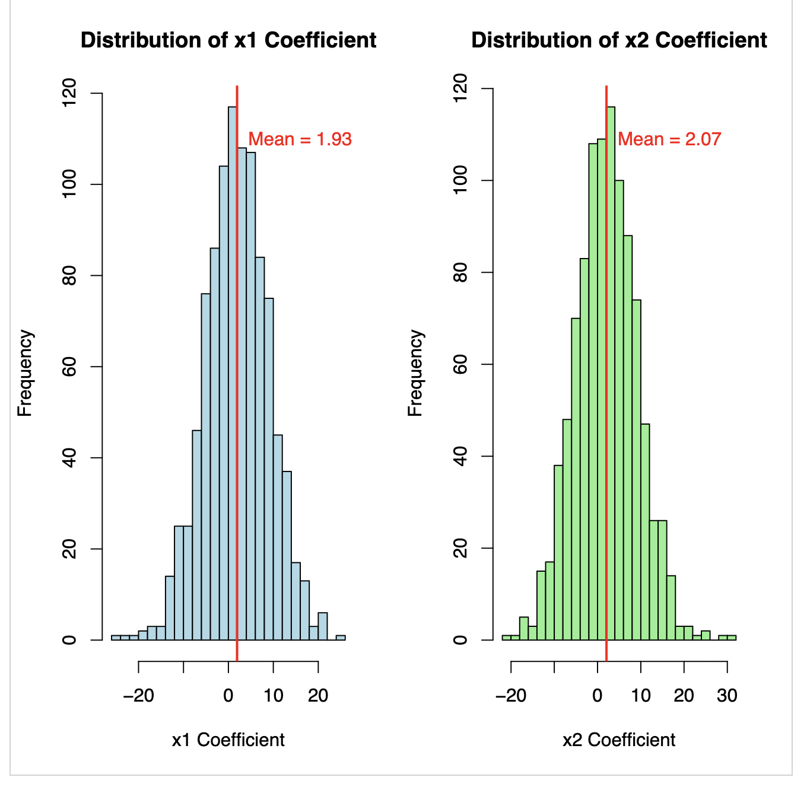

The variance in both x1 and x2 seems to be large
The coefficients approaches the true coefficients in the original y formula. 2 and 2
The coefficients looks like a normal distribution. (to dig deeper)