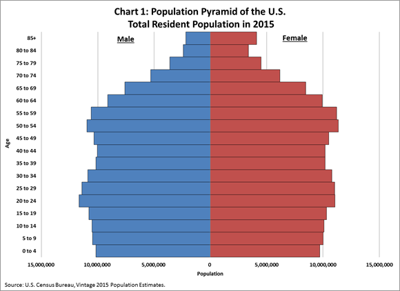

```{R importlibrary,,echo = FALSE,eval = TRUE,include = FALSE}
library("haven")
library("survey")
library("jtools")
library("remotes")
library("svrepmisc")
library("dplyr")
library("DT")
library("caret")
library("pROC")
library("car")
```


## Project Inroduction

My lab results showed abnormal cholesterol and triglyceride levels, and my doctor informed me that I am at increased risk. For this reason, I chose this topic. The initial project plan included performing population parameter analysis as well, but conducting the regression alone took a significant amount of time, so those analyses were ultimately excluded.

The main challenge of the project came from the NHANES sample design. Because of the complex multistage sampling approach, NHANES assigns different weights to different variables and subsamples. Understanding this design and selecting the correct weights was the most difficult and time-consuming part of the project.

In summary, this project aims to predict coronary heart disease using high-density cholesterol, low-density cholesterol, and triglycerides.


## Data Introduction.

In 2021–2023, individuals participated in NHANES interviews and medical examinations. The NHANES program uses a multistage sampling design that intentionally oversamples people with certain characteristics, such as specific racial/ethnic groups or age categories. Because of this design—and for other methodological reasons—NHANES assigns different sampling weights to different variables and subsamples. For more information about the sample design and weighting procedures, please refer to the source provided below.

Five datasets were downloaded from the NHANES website and merged using the participant sequence number (SEQN):

DEMO_L.csv – demographic information<br>
HDL_L.csv – high-density cholesterol measurements<br>
TRIGLY_L.csv – low-density cholesterol and triglyceride measurements<br>
TCHOL_L.csv – total cholesterol measurements<br>
MCQ_L.csv – self-reported history of angina, heart attack, or cardiovascular disease<br>


The suffix “_L” indicates that the data come from the 2021–2023 cycle.
These files have different numbers of rows because only a subset of interview respondents participate in particular laboratory tests. DEMO_L.csv contains the largest number of rows since all participants provide demographic information.

For details on data preprocessing, please refer to the two preprocessing scripts included in the project folder.

[Click Here for Data Source](https://wwwn.cdc.gov/nchs/nhanes/search/datapage.aspx?Component=Laboratory&Cycle=2021-2023)<br>
[Click Here to learn more about the sample design and weights](https://wwwn.cdc.gov/nchs/nhanes/tutorials/weighting.aspx)


## Methods

Logistic regressions are used to construct models.First, we construct models without using any weights. Then, we construct the models with the most appropriate weight. At last, we construct models with the second best weight. Then, we evaluate the impact of weight of on the area under the curve. 

## Data Overview

``` {R importData000, echo = FALSE,include = FALSE}
unweighted_data =  read.csv("cleaned_data.csv")
weighted_data =  read.csv("cleaned_data_with_weights.csv")
```


### Age Distribution

``` {R ageHistogramSideBySide, echo = FALSE,include = TRUE,fig.width=10, fig.height=4}
# set plotting area: 1 row, 2 columns
par(mfrow = c(1, 2))

# ---------- Unweighted histogram ----------
hist(
  weighted_data$age,
  breaks = seq(
    floor(min(weighted_data$age, na.rm = TRUE)),
    ceiling(max(weighted_data$age, na.rm = TRUE)),
    by = 5
  ),
  main = "Unweighted",
  xlab = "Age",
  col = "lightblue",
  border = "black",
  probability = TRUE
)

# ---------- Weighted ----------
design_age <- svydesign(
  ids = ~SDMVPSU,
  strata = ~SDMVSTRA,
  weights = ~WTINT2YR,
  nest = TRUE,
  data = weighted_data
)

svyhist(
  ~age,
  design = design_age,
  breaks = seq(
    floor(min(weighted_data$age, na.rm = TRUE)),
    ceiling(max(weighted_data$age, na.rm = TRUE)),
    by = 5
  ),
  main = "Weighted Age Distribution",
  xlab = "Age",
  col = "lightblue"
)

# reset layout so it does not affect later plots
par(mfrow = c(1, 1))

```


Conclusion: using the interview weight WTINT2YR changes the histogram. The histogram with weight better represents the US population, but there is still a big difference with the distribution provided by US Census Bureau.The percentage of population between our 60 and 80 is much larger than the one shown in the following image from US Census Bureau.

<p align="center">
  
</p>


### Coronary Heart Disease Prevalence Amoung US Adults


``` {R coronaryDiseasePrevalenceWithWeightSideBySide, echo = FALSE,include = TRUE}
par(mfrow = c(1, 2))   # 1 row, 2 columns

# --- Unweighted pie chart ---
adult_data <- subset(weighted_data, age >= 18)

coronary_labels <- c("1" = "Yes", "0" = "No")
coronary_counts <- table(coronary_labels[as.character(adult_data$coronary)])
colors <- rainbow(length(coronary_counts))
pct <- round(coronary_counts / sum(coronary_counts) * 100)
coronary_lbl <- paste0(names(coronary_counts), " (", pct, "%)")

pie(
  coronary_counts,
  labels = coronary_lbl,
  main = "Unweighted",
  col = colors
)

# --- Weighted pie chart ---
cor <- adult_data$coronary
wts <- adult_data$WTINT2YR

weighted_counts <- tapply(wts, cor, sum, na.rm = TRUE)
names(weighted_counts) <- coronary_labels[names(weighted_counts)]
pct <- round(weighted_counts / sum(weighted_counts) * 100)
coronary_lbl <- paste0(names(weighted_counts), " (", pct, "%)")
colors <- rainbow(length(weighted_counts))

pie(
  weighted_counts,
  labels = coronary_lbl,
  main = "Weighted",
  col = colors
)

# reset layout
par(mfrow = c(1,1))


```


Conclusion: using the interview subsample weight WTINT2YR decreases the prevalence by 1%, however, both estimates are close to the CDC 5% estimation. [Data Source](https://www.cdc.gov/nchs/fastats/heart-disease.htm)


## Logistic Regression

In this section, we try to predict if a person has a coronary heart disease.

### Logistic Regression Without Using Weights

In the beginning, I ignored the various weights in the dataset because I wasn’t sure what they meant or how to apply them correctly. As a result, my initial models produced AUC scores around 0.5. I assumed the poor performance was due to not using the weights, so I decided to incorporate them to improve the results. However, while writing this report, I discovered that the low AUC was actually caused by a bug in my original code. After fixing the bug, the ROC curves looked normal. The corrected models are shown below.


``` {R dataPreparationWithoutWeight, echo = FALSE,include = FALSE}

data = read.csv("cleaned_data.csv")
head(data)

set.seed(123)   # for reproducibility

# First split: train vs rest (2/3 remain)
index1 <- createDataPartition(data$coronary, p = 1/3, list = FALSE)
train <- data[index1, ]
rest  <- data[-index1, ]

# Second split: validation vs test (each 1/3 of full data)
index2 <- createDataPartition(rest$coronary, p = 1/2, list = FALSE)
validation <- rest[index2, ]
test <- rest[-index2, ]

```

Training with 3 predictors

``` {R fittingModelWithoutWeightMultiplePredictors, echo = TRUE,include = TRUE}

# -----model with multiple predictors-----------.
# 1. Fit on training set
model <- glm(
  coronary ~ high_density_level + low_density_level + triglyceride_level,
  family = binomial,
  data = train
)

# 2. Predict on *validation* set
validation$prob <- predict(
  model,
  newdata = validation,
  type = "response"
)

# 3. ROC on validation set

g <- roc(response = validation$coronary,
         predictor = validation$prob)

g

```

Training with one predictor.

``` {R fittingModelWithoutWeightOnePredictor, echo = TRUE,include = TRUE}
# --------- 1. Fit model on TRAIN only --------------

model <- glm(
  coronary ~ low_density_level,
  family = binomial,
  data = train
)

# --------- 2. Predict on VALIDATION only -----------

validation$prob <- predict(
  model,
  newdata = validation,
  type = "response"
)

# --------- 3. Compute ROC on VALIDATION -----------

library(pROC)

g <- roc(
  response  = validation$coronary,
  predictor = validation$prob
)

g
```


### Logistic Regression With Weights

Because of the low AUC values caused by the bug—and my mistaken belief that the issue was due to ignoring the weights—I decided to incorporate survey weights into the regression. To learn how to use them properly, I studied the NHANES sample design, which I had never encountered before and initially found difficult to understand. Another challenge was selecting an appropriate weight, since the dataset contains multiple weight variables. It took time to learn the rule: when multiple subsamples are involved in the analysis, you must choose the weight corresponding to the smallest subsample.

In my case, I had two relevant subsamples: the phlebotomy subsample (participants who provided blood specimens) and the fasting subsample (participants instructed to fast). Determining which one was smaller took several hours of reading documentation and examining the data. Eventually, I learned that the fasting subsample is smaller because participants must fast first before providing a blood specimen.


#### Logistic Regression With Weight_2(Fasting Subsample Weight)


In the beginning, the models failed to converge regardless of how many predictors I included. This turned out to be another bug that I did not initially notice. I mistakenly assumed the non-convergence was caused by an insufficient number of data points in the fasting subsample, since it is the smallest subsample in NHANES. Eventually, the models did begin to converge after I made several changes, but I unfortunately lost track of which specific change resolved the issue.

The regression results using weight 2 are presented below. To correctly apply survey weights, the svydesign() function must be used to construct a survey design object, and this design object must then be supplied to the regression function.

```{R loadData2,,echo = FALSE,eval = TRUE,include = FALSE}
result = read.csv("cleaned_data_with_weights.csv")
```


```{R weight2Prepare,,echo = FALSE,eval = TRUE,include = FALSE }
result = subset(result, !is.na(result$weight_2))
# First split: train vs rest (2/3 remain)
index1 <- createDataPartition(result$SEQN, p = 1/3, list = FALSE)
train <- result[index1, ]
rest  <- result[-index1, ]

# Second split: validation vs test (each 1/3 of full data)
index2 <- createDataPartition(rest$SEQN, p = 1/2, list = FALSE)
validation <- rest[index2, ]
test <- rest[-index2, ]

# make the design object for train, validation,test
design_train <- svydesign(
  ids = ~SDMVPSU,
  strata = ~SDMVSTRA,
  weights = ~weight_2, # using the smaller subsample weight - fasting weight.
  nest = TRUE,
  data = train
)


design_validation <- svydesign(
  ids = ~SDMVPSU,
  strata = ~SDMVSTRA,
  weights = ~weight_2, # using the smaller subsample weight - fasting weight.
  nest = TRUE,
  data = validation
)

design_test <- svydesign(
  ids = ~SDMVPSU,
  strata = ~SDMVSTRA,
  weights = ~weight_2, # using the smaller subsample weight - fasting weight.
  nest = TRUE,
  data = test
)

# filter out columns with missing values. 
# We should subset on the design object directly instead of the the dataframe.

design_train_sub <- subset(design_train,
                           !is.na(coronary) &
                             !is.na(high_density_level) &
                             !is.na(low_density_level)&
                             !is.na(triglyceride_level)
                           )
nrow(design_train_sub)

design_validation_sub <- subset(design_validation,
                                !is.na(coronary) &
                                  !is.na(high_density_level) &
                                  !is.na(low_density_level)&
                                  !is.na(triglyceride_level)
                                
                                )
                                  
nrow(design_validation_sub)

design_test_sub <- subset(design_test,
                          !is.na(coronary) &
                            !is.na(high_density_level) &
                            !is.na(low_density_level)&
                            !is.na(triglyceride_level))
nrow(design_test_sub)
result = subset(result, !is.na(result$weight_2))


```

Fitting a model 3 predictors

```{R weight2with3predictors,echo = TRUE,include = TRUE}
# --------- model with 3 predictors -----------------------
# train model on the train set
model1 <- svyglm(
  coronary ~ high_density_level +low_density_level +triglyceride_level  ,
  design = design_train_sub,
  family = quasibinomial()
)

# predict on the validation set.

val_df <- design_validation_sub$variables
val_df$predicted <- predict(model1, newdata = val_df, type = "response")

roc_val_three <- roc(
  response = val_df$coronary,
  predictor = val_df$predicted,
  weights = val_df$weight_2
)

roc_val_three


```


Fitting another model with low_density_cholesterol.

```{R weight2with1predictor,echo = TRUE,include = TRUE}
# --------- model one predictor : low density level -----------------------

# train model on the train set
model5 <- svyglm(
  coronary ~ low_density_level ,
  design = design_train_sub,
  family = quasibinomial()
)

summary(model5)

# predict on the validation set.

val_df <- design_validation_sub$variables
val_df$predicted <- predict(model5, newdata = val_df, type = "response")

roc_val_LDL <- roc(
  response = val_df$coronary,
  predictor = val_df$predicted,
  weights = val_df$weight_2
)

roc_val_LDL
```


#### Logistic Regression With Weight_1(Phlebotomy Subsample Weight)

Since my initial attempts to use weight_2(fast subsample weight) didn't work out, the Phlebotomy weight was used because it was the weight for the second smallest subsample and also my only choice left. 


```{R loadData3,,echo = FALSE,eval = TRUE,include = FALSE}
result = read.csv("cleaned_data_with_weights.csv")
```

```{R weight1Preparation, echo = FALSE,include = FALSE}

result = subset(result, !is.na(result$weight_1))

# First split: train vs rest (2/3 remain)
index1 <- createDataPartition(result$SEQN, p = 1/3, list = FALSE)
train <- result[index1, ]
rest  <- result[-index1, ]

# Second split: validation vs test (each 1/3 of full data)
index2 <- createDataPartition(rest$SEQN, p = 1/2, list = FALSE)
validation <- rest[index2, ]
test <- rest[-index2, ]

# make the design object for train, validation,test
design_train <- svydesign(
  ids = ~SDMVPSU,
  strata = ~SDMVSTRA,
  weights = ~weight_1, # using the smaller subsample weight - fasting weight.
  nest = TRUE,
  data = train
)


design_validation <- svydesign(
  ids = ~SDMVPSU,
  strata = ~SDMVSTRA,
  weights = ~weight_1, # using the smaller subsample weight - fasting weight.
  nest = TRUE,
  data = validation
)

design_test <- svydesign(
  ids = ~SDMVPSU,
  strata = ~SDMVSTRA,
  weights = ~weight_1, # using the smaller subsample weight - fasting weight.
  nest = TRUE,
  data = test
)

# filter out columns with missing values. 
# We should subset on the design object directly instead of the the dataframe.

design_train_sub <- subset(design_train,
                     !is.na(coronary) &
                       !is.na(high_density_level) &
                       !is.na(low_density_level))
nrow(design_train_sub)

design_validation_sub <- subset(design_validation,
                           !is.na(coronary) &
                             !is.na(high_density_level) &
                             !is.na(low_density_level))
nrow(design_validation_sub)

design_test_sub <- subset(design_test,
                           !is.na(coronary) &
                             !is.na(high_density_level) &
                             !is.na(low_density_level))
nrow(design_test_sub)

```

##### Logistic Regression With Weight_1 and Two Predictors

Fitting a model using high_density_level and low_density_level. Unfortunately, the triglyceride_level cannot be used here.

```{R regressionWithWeight_1With2Predictors, echo = TRUE,include = TRUE}
# --------- model with two predictors -----------------------
# train model on the train set
model <- svyglm(
  coronary ~ high_density_level +low_density_level ,
  design = design_train_sub,
  family = quasibinomial()
)

summary(model)

# predict on the validation set.

val_df <- design_validation_sub$variables
val_df$predicted <- predict(model, newdata = val_df, type = "response")

roc_val_both <- roc(
  response = val_df$coronary,
  predictor = val_df$predicted,
  weights = val_df$weight_1
)

roc_val_both


```


##### Logistic Regression With Weight_1 and One Predictor

We fit another model with low_density_level.

```{R regressionWithWeight_1With1LDL, echo = TRUE,include = TRUE}
# train model on the train set
model <- svyglm(
  coronary ~ low_density_level ,
  design = design_train_sub,
  family = quasibinomial()
)

summary(model)

# predict on the validation set.

val_df <- design_validation_sub$variables
val_df$predicted <- predict(model, newdata = val_df, type = "response")

roc_val_LDL <- roc(
  response = val_df$coronary,
  predictor = val_df$predicted,
  weights = val_df$weight_1
)

roc_val_LDL

```


## Conclusion

Even though NHANES uses a multistage sampling design to oversample certain subgroups of the population—and strongly emphasizes the importance of using weights in regression—the impact of omitting the weights, or even using a less appropriate weight, appears to have little effect on the prediction results in this project. For example, in a logistic regression model with a single predictor (low_density_level), the AUC values were nearly identical regardless of whether weights were used or which weight variable was applied.


At last, we choose the the last model with one predictor and plot its ROC curve and calculate its accuracy.

``` {R name, echo = TRUE,include = TRUE}

plot(roc_val_LDL)

# 1.choose the best threshold for this model and calculate the accuracy. 

roc_obj <- roc(response = val_df$coronary, predictor = val_df$predicted)
best <- coords(roc_obj, "best", best.method="closest.topleft")
best

best_threshold <- as.numeric(best$threshold)

# 2. predicted classes using optimal threshold
val_df$predicted_labels <- ifelse(val_df$predicted >= best_threshold[], 1, 0)

# 3. accuracy
accuracy <- mean(val_df$predicted_labels == val_df$coronary)
accuracy
```


